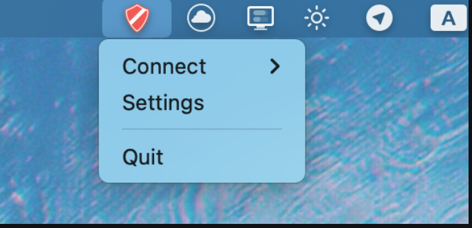
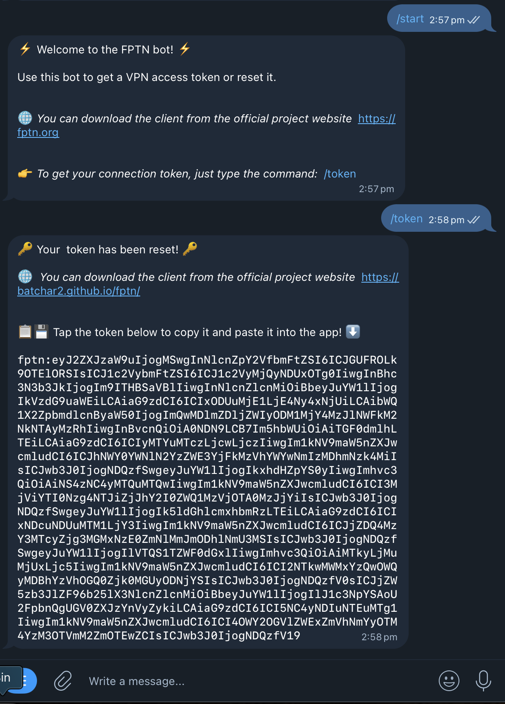
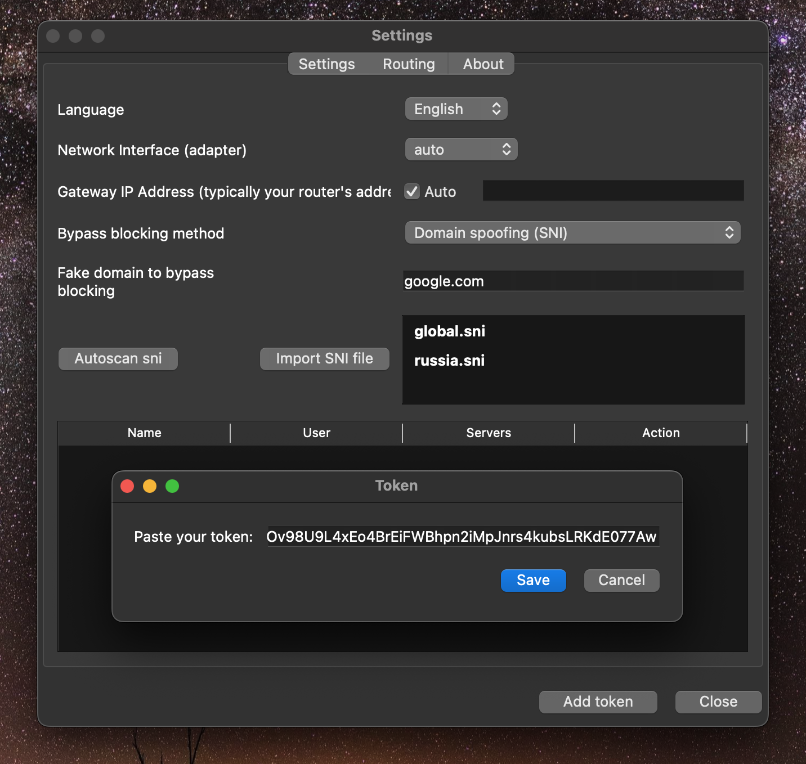
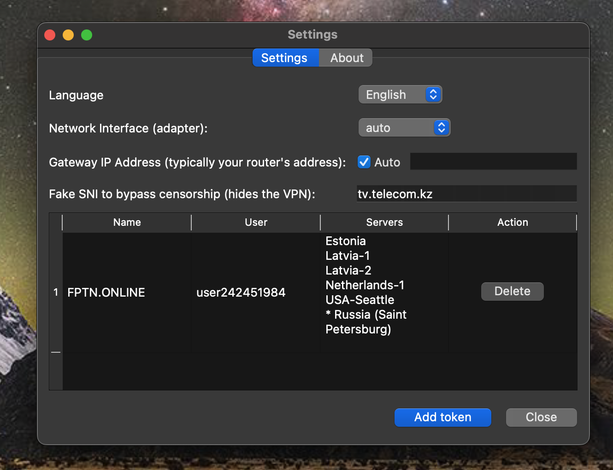
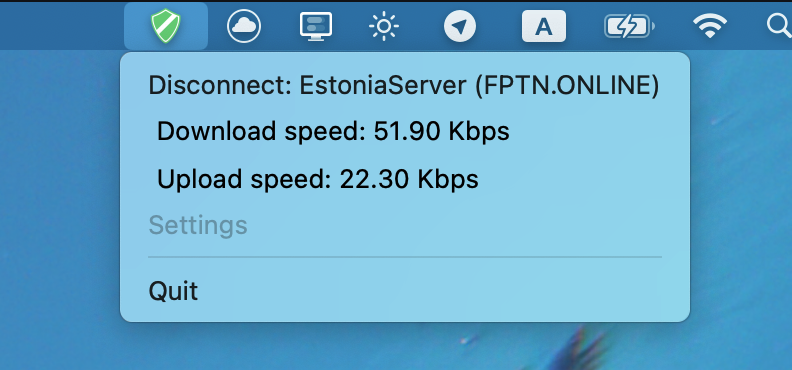
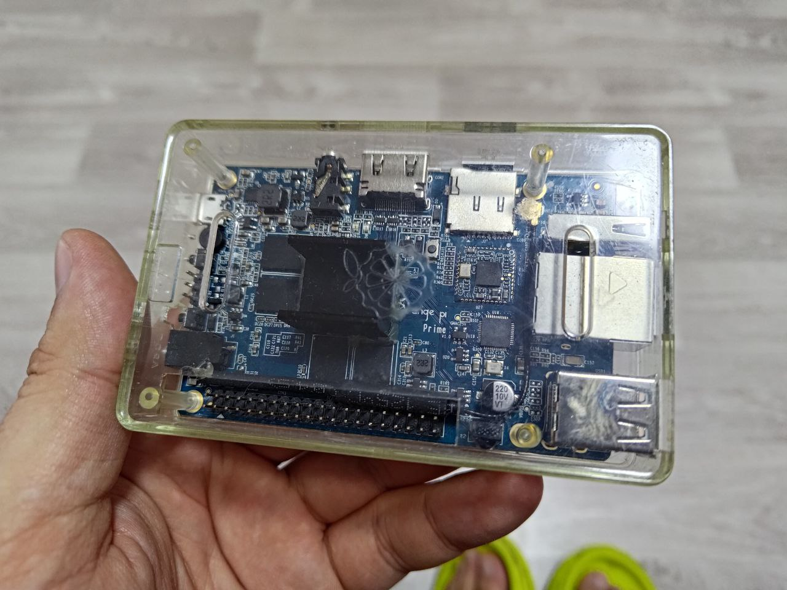

<div align="center">

<H1>FPTN</H1>
<H6>Custom VPN technology</H6>

[\[English\]](README.md)
•
[\[Русский\]](README_RU.md)


[](https://github.com/batchar2/fptn/releases)
[](https://github.com/batchar2/fptn/releases)
[](https://github.com/batchar2/fptn/releases)
[](https://github.com/batchar2/fptn/releases)
[](https://github.com/batchar2/fptn/actions/workflows/main.yml)
[](https://github.com/batchar2/fptn/releases)
</div>


### Core Features of FPTN

FPTN is a VPN technology built from the ground up to provide secure, censorship- and block-resistant connections that can bypass censorship and network filtering.

Core features include:

1. **L3 Tunnel (IP-level)**
  - Transmits IP packets (IPv4 and IPv6) through a VPN tunnel to the server.
  - **Split-tunneling** support – the ability to route only specific traffic through the VPN while allowing the rest to go directly. Enables flexible routing policy configuration based on rules for domains and networks.
  - **NAT** is implemented on the server side. Future plans include support for grouping users into virtual local networks for peer-to-peer interaction.

2. **Traffic Obfuscation and Blocking Evasion**
  - **Resistant to active DPI**: The server identifies clients via the TLS handshake by analyzing the `session_id` (which the FPTN client can set using a special time-based method). If the client is not recognized as an FPTN client, the server returns legitimate content for the requested domain, acting as a transparent proxy.
  - The VPN connection is disguised as regular HTTPS traffic (a mode for short-lived HTTPS connections is also under development).
  - Three implemented methods for evading blocks:
    1. **SNI Spoofing**: A fake domain is set in the TLS packet initiating the connection. Traffic analysis systems see a legitimate connection, while the traffic is actually routed to the VPN server.
    2. **Obfuscation**: Traffic mimics an already established TLS session, hiding the TLS handshake and preventing DPI detection.
    3. **Reality Mode + SNI**: The client initiates a connection to the VPN server with spoofed SNI, receives a real TLS handshake from an actual website, and then continues data exchange with the VPN server within the same connection.
  - The desktop client features an integrated `SNI scanner`.

3. **Transport Protocol**
  - Uses a custom transport protocol based on **Protobuf** for data transmission between client and server.
  - **Protocol-level padding**: Data packets are padded with random data to randomize traffic and hinder analysis.
  - The server provides a **REST API** for client authorization and fetching special configurations.

4. **Advanced Features**
  - Built-in filtering of unwanted traffic (e.g., BitTorrent protocol).
  - Per-user speed and traffic control: The server includes a traffic shaper based on the **Leaky Bucket** algorithm, allowing flexible speed policy configuration.
  - Support for a multi-server architecture with a single master server storing all user information.
  - System monitoring via **Prometheus** and visualization in **Grafana**.
  - User onboarding via a **Telegram bot**.

5. **Cross-Platform Clients**
  - A cross-platform library, **`libfptn`**, has been developed for use across various operating systems. It internally implements the FPTN network protocol, connection management, and data transmission mechanisms for the VPN tunnel.
  - **Desktop:** Windows, macOS, Linux – a minimalistic client focused on ease of use.
  - **Mobile:** Android, iOS (under development).

6. **Easy Setup via Token**
  - A **Token** is a specially generated configuration file containing all necessary system settings.
  - Enables VPN connection without manual configuration or extra steps: simply add the token to the client to start using the service.


### Demonstration

*🍏🍎MacOS users are recommended to review the [macOS installation guide](docs/macos/README.md), as macOS includes additional security measures that may require specific actions.*

Download the FPTN client from the [website](http://batchar2.github.io/fptn/) or [GitHub](https://github.com/batchar2/fptn/releases). After downloading, install and launch the client.

The client is a compact application whose icon resides in the system tray.

Simply click the icon to open the context menu.



Navigate to the "Settings" menu, where you need to add an access token.
Obtain a token by contacting our <a target="_blank" href="https://t.me/fptn_bot">Telegram bot</a>,



Copy the token, click the "Add Token" button, paste it into the form, and save.



After this, available servers will appear in the list.



Ease of use:



You can also easily turn your Raspberry Pi or Orange Pi into a WiFi access point and install the FPTN client on it.
In this case, all devices connected to this WiFi network will be able to access the internet, bypassing any restrictions.
[Read more here](https://github.com/batchar2/fptn/blob/master/deploy/linux/wifi/README.md)




### Installation, Building, and Configuration


<details>
  <summary><strong>Installing and Configuring the FPTN Server</strong></summary>

Setting up and running your own FPTN server is done via Docker.
This ensures easy deployment, convenient updates, and environment isolation.
Instructions are available on [DockerHub](https://hub.docker.com/r/fptnvpn/fptn-vpn-server).

You can also deploy your own management and monitoring tools:
- **Telegram bot** – issuing tokens to users [sysadmin-tools/telegram-bot/README.md](sysadmin-tools/telegram-bot/README.md).
- **Grafana + Prometheus** – monitoring server and user status [sysadmin-tools/grafana/README.md](sysadmin-tools/grafana/README.md)

</details>


<details>
  <summary>Building the Project from Source</summary>

1. Install required dependencies
- For [Windows](deploy/windows/README.md)
- For [Ubuntu](deploy/linux/deb/README.md)
- For [macOS](deploy/macos/README.md)

2. Install Conan (version 2.22.2):

```bash
pip install conan==2.22.2
```

3. Detect and configure the Conan profile:

```bash
conan profile detect --force
```

4. Install dependencies, build, and install:

```bash
conan install . --output-folder=build --build=missing  -s compiler.cppstd=17 -o with_gui_client=True --settings build_type=Release


# Linux & macOS only
cmake .. -DCMAKE_TOOLCHAIN_FILE=conan_toolchain.cmake -DCMAKE_BUILD_TYPE=Debug
# Windows only
cmake .. -G "Visual Studio 17 2022" -DCMAKE_TOOLCHAIN_FILE="conan_toolchain.cmake" -DCMAKE_BUILD_TYPE=Debug

cmake --build . --config Release
ctest
```

5. Building the Installer


- Windows

  ```bash
  cmake --build . --config Release --target build-installer
  ```

- Ubuntu

  ```bash
  cmake --build . --config Release --target build-deb-gui
  ```
  
- macOS

  ```bash
  cmake --build . --target build-pkg
  ```

</details>


<details>

<summary>Using CLion IDE for Development</summary>

Run the following command in the project's root folder:

```bash
conan install . --output-folder=cmake-build-debug --build=missing -s compiler.cppstd=17 -o with_gui_client=True --settings build_type=Debug
```

Open the project in CLion. After opening, the Open Project Wizard window will appear automatically. In it, you need to add the following CMake parameter:

```bash
-DCMAKE_TOOLCHAIN_FILE=conan_toolchain.cmake
```

</details>


### About the Project

FPTN is developed by a team of volunteers and independent developers.

If you wish to support the project, you can donate via [Boosty](https://boosty.to/fptn). Project sponsors have speed limits removed on our servers and (optionally) have their usernames published in FPTN clients.

Our Telegram chat for users and developers: [FPTN Project](https://t.me/fptn_project)

Join the community and the development team!
