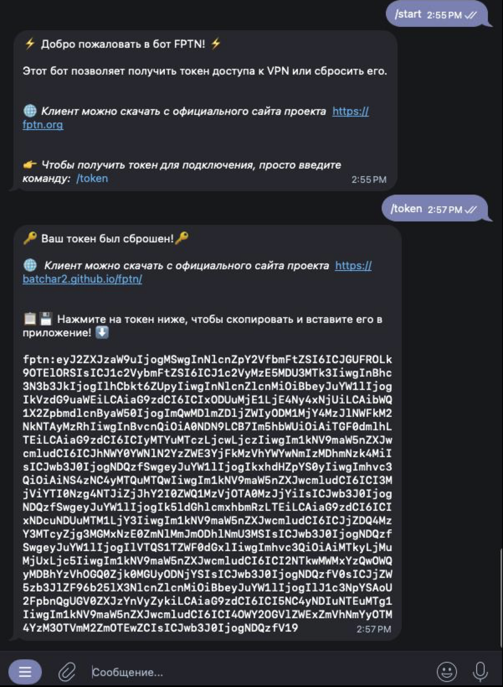

<div align="center">

<H1>FPTN</H1>
<H6>Custom VPN technology</H6>

[\[English\]](README.md)
•
[\[Русский\]](README_RU.md)


[](https://github.com/batchar2/fptn/releases)
[](https://github.com/batchar2/fptn/releases)
[](https://github.com/batchar2/fptn/releases)
[](https://github.com/batchar2/fptn/releases)
[](https://github.com/batchar2/fptn/actions/workflows/main.yml)
[](https://github.com/batchar2/fptn/releases)
</div>

---

### Основные возможности FPTN


FPTN — это VPN-технология, созданная с нуля для безопасного и устойчивого к блокировкам соединения, позволяющего обходить цензуру и сетевую фильтрацию.

Сайт проекта: [https://storage.googleapis.com/fptn.org/index.html](https://storage.googleapis.com/fptn.org/index.html)

Основные возможности включают:

1. **L3-туннель (IP-уровень)**
  - Передача IP-пакетов (IPv4 и IPv6) через VPN-туннель до сервера.
  - Поддержка **split-tunneling** — возможность направлять через VPN только определённый трафик, а остальной трафик идёт напрямую. Позволяет гибко настраивать политику маршрутизации на основе указания правил для доменов и сетей.
  - На серверной стороне реализован **NAT**. В дальнейшем планируется поддержка объединения пользователей в группы с созданием виртуальных локальных сетей для совместного взаимодействия.

2. **Маскировка трафика и обход блокировок**
  - **Устойчивость к активному DPI**: сервер способен идентифицировать клиентов по TLS-handshake, анализируя session_id (значение которого умеет устанавливать FPTN-клиент по специальному методу от времени). Если определяется, что клиент не является FPTN-клиентом, сервер возвращает легитимный контент запрашиваемого домена, выступая в роли прозрачного прокси.
  - VPN-соединение маскируется под обычный HTTPS-трафик (еще в разработке — режим короткоживущих HTTPS-соединений).
  - Реализованы три метода обхода блокировок:
    1. **Подмена SNI**: в инициирующем соединение TLS-пакете устанавливается поддельный домен. Системы анализа трафика видят легитимное соединение, а на самом деле трафик направляется на VPN-сервер.
    2. **Обфускация**: трафик выглядит как уже установленная TLS-сессия, скрывая TLS-handshake и предотвращая детектирование DPI.
    3. **Reality Mode + SNI**: клиент инициирует соединение с VPN-сервером с подменой SNI, получает реальный TLS-handshake от настоящего сайта, после чего в том же соединении продолжается обмен данными с VPN-сервером.
  - В десктопной версии клиента реализован `сканнер SNI`.

3. **Транспортный протокол**
  - Используется собственный транспортный протокол на основе **Protobuf** для передачи данных между клиентом и сервером.
  - **Padding на уровне протокола**: пакеты данных дополняются случайными данными для рандомизации трафика и затруднения анализа.
  - Сервер предоставляет **REST API** для авторизации клиентов и получения специальных настроек.

4. **Специальные возможности**
  - Встроенная фильтрация нежелательного трафика (например, протокол BitTorrent).
  - Контроль скорости и трафика каждого пользователя: сервер включает шейпер на основе алгоритма **Leaky Bucket**, что позволяет гибко настраивать политику скорости.
  - Поддержка многосерверной архитектуры с одним мастер-сервером, где хранится вся информация о пользователях.
  - Мониторинг работы системы через **Prometheus** и визуализация в **Grafana**.
  - Возможность подключения пользователей через **Telegram-бота**.

5. **Кроссплатформенные клиенты**
  - Разработана кроссплатформенная библиотека **`libfptn`**, которая может использоваться на различных операционных системах. Внутри реализованы сетевой протокол FPTN, управление соединением и механизмы передачи данных через VPN-туннель.
  - **Десктоп:** Windows, macOS, Linux — минималистичный клиент с акцентом на простоту использования.
  - **Мобильные устройства:** Android, iOS (в разработке).

6. **Простая настройка через токен**
  - **Токен** — это специально сгенерированный конфигурационный файл, который содержит все необходимые настройки системы.
  - Позволяет подключаться к VPN без ручной конфигурации и лишних действий: достаточно добавить токен в клиент, чтобы начать работу.

---

### Демонстрация работы

*🍏🍎Пользователям MacOS рекомендуется ознакомиться с [руководством по установке для macOS](docs/macos/README.md), так как в macOS присутствуют дополнительные меры безопасности, которые могут потребовать особых действий.*

Скачайте клиент FPTN с [веб-сайта](http://batchar2.github.io/fptn/) или [GitHub](https://github.com/batchar2/fptn/releases). После скачивания установите и запустите клиент.

Клиент представляет собой компактное приложение, значок которого находится в системном трее.

Просто нажмите на значок, чтобы открыть контекстное меню.


Перейдите в меню "Настройки", где необходимо добавить токен доступа.
Получите токен, обратившись к нашему <a target="_blank" href="https://t.me/fptn_bot">Telegram-боту</a>,



Скопируйте токен, нажмите кнопку "Добавить токен", вставьте его в форму и сохраните.


После этого в списке появятся доступные серверы.


Простота использования:


Вы также можете легко превратить свой Raspberry Pi или Orange Pi в точку доступа WiFi и установить на него клиент FPTN.
В этом случае все устройства, подключенные к этой WiFi-сети, смогут выходить в интернет, обходя любые ограничения.
[Подробнее читайте здесь](https://github.com/batchar2/fptn/blob/master/deploy/linux/wifi/README.md)


---

### Установка, сборка и настройка


<details>
  <summary><strong>Установка и настройка FPTN сервера</strong></summary>

Настройка и запуск собственного сервера FPTN выполняются через Docker.  
Это обеспечивает простое развертывание, удобное обновление и изоляцию окружения.
Инструкция доступна в [DockerHub](https://hub.docker.com/r/fptnvpn/fptn-vpn-server).

Так же вы можете развернуть собственные инструменты для управления и мониторинга:
- **Telegram-бот** — выдача токенов пользователмм [sysadmin-tools/telegram-bot/README.md](sysadmin-tools/telegram-bot/README.md).
- **Grafana + Prometheus** — мониторинг состояния серверов и пользователей   [sysadmin-tools/grafana/README.md](sysadmin-tools/grafana/README.md)

</details>


<details>
  <summary>Сборка проекта из исходников</summary>

1. Установите требуемые зависимости
- Для [Windows](deploy/windows/README.md)
- Для [Ubuntu](deploy/linux/deb/README.md)
- Для [macOS](deploy/macos/README.md)

2. Установите Conan (версия 2.24.0):

```bash
pip install conan==2.24.0
```

3. Определите и настройте профиль Conan:

```bash
conan profile detect --force
```

4. Установите зависимости, выполните сборку и установку:

```bash
conan install . --output-folder=build --build=missing  -s compiler.cppstd=17 -o with_gui_client=True --settings build_type=Release

cd build

# Только Linux & macOS
cmake .. -DCMAKE_TOOLCHAIN_FILE=conan_toolchain.cmake -DCMAKE_BUILD_TYPE=Debug
# Только для Windows
cmake .. -G "Visual Studio 17 2022" -DCMAKE_TOOLCHAIN_FILE="conan_toolchain.cmake" -DCMAKE_BUILD_TYPE=Debug

cmake --build . --config Release
ctest
````

5. Сборка установщика
  - Windows
    
    ```bash
    cmake --build . --config Release --target build-installer
    ```
    
  - Ubuntu
    
    ```bash
    cmake --build . --config Release --target build-deb-gui
    ```
    
  - macOS
  
    ```bash
    cmake --build . --target build-pkg
    ```

</details>

<details>
  <summary>Использование CLion IDE для разработки</summary>

Выполните следующую команду в корневой папке проекта:

```bash
conan install . --output-folder=cmake-build-debug --build=missing -s compiler.cppstd=17 -o with_gui_client=True --settings build_type=Debug
```

Откройте проект в CLion. После открытия автоматически появится окно **Open Project Wizard**. В нём необходимо добавить следующий параметр CMake:


```bash
-DCMAKE_TOOLCHAIN_FILE=conan_toolchain.cmake
```

</details>

---

### О проекте

FPTN развивается командой волонтёров и независимых разработчиков.

Если вы хотите поддержать проект, вы можете оформить донат на [Boosty](https://boosty.to/fptn). Спонсорам проекта снимаем ограничения скорости на наших серверах и (по желанию) публикуем их ники в FPTN-клиентах.

Наш Telegram-чат для пользователей и разработчиков [FPTN Project](https://t.me/fptn_project)

Присоединяйтесь к сообществу и команде разработчиков!

---

## Инструменты сообщества

Следующие инструменты разработаны и поддерживаются сообществом для расширения возможностей или упрощения работы с FPTN.

### fptn-manager

Небольшой внешний инструмент управления, построенный вокруг FPTN и ориентированный на упрощение развёртывания и повседневных административных задач.

Особенно полезен для пользователей, которые не хотят работать напрямую с Docker-командами или внутренними настройками конфигурации.

Возможности:
- Установщик на базе Docker
- Интерактивный CLI для управления пользователями, паролями и токенами
- Упрощённая первичная настройка и повторяющиеся операции

Репозиторий проекта: https://github.com/FarazFe/fptn-manager
