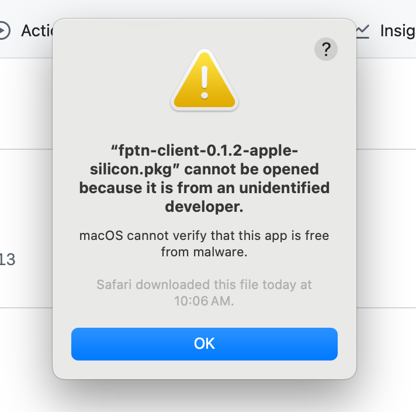
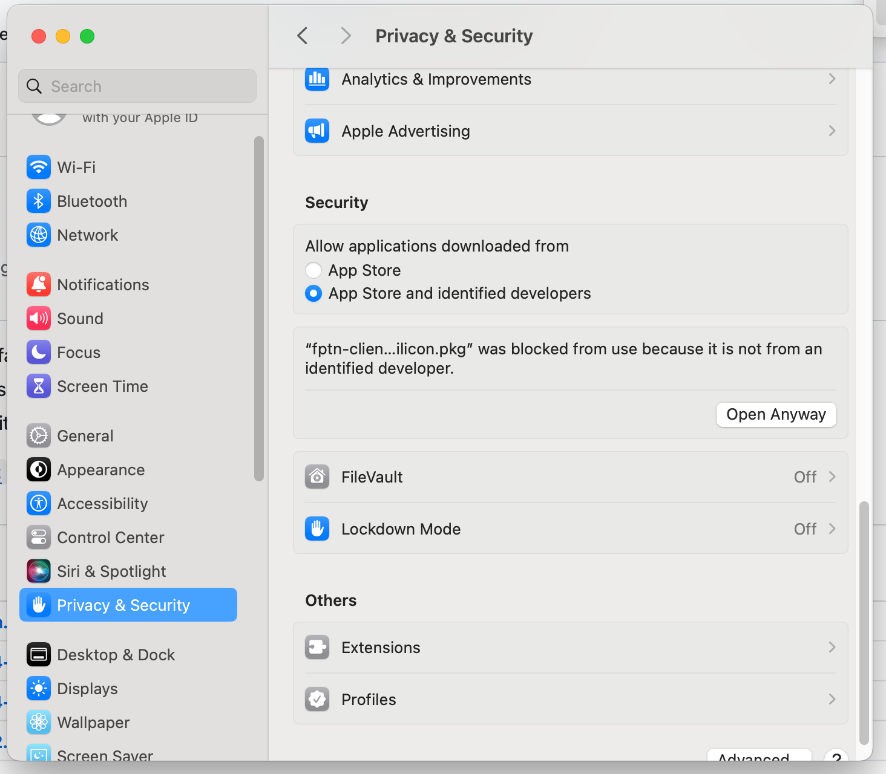
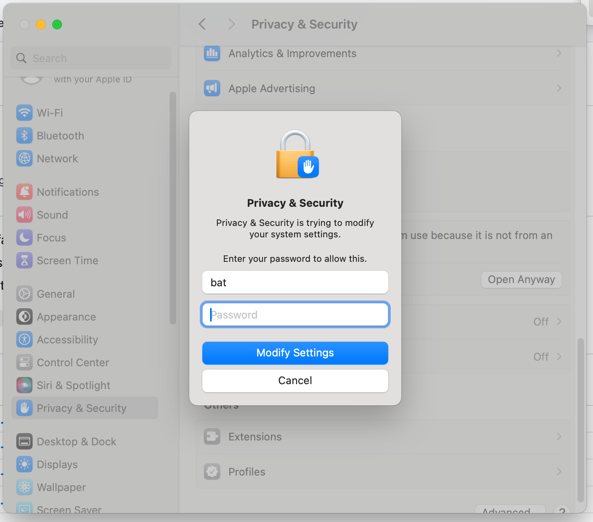
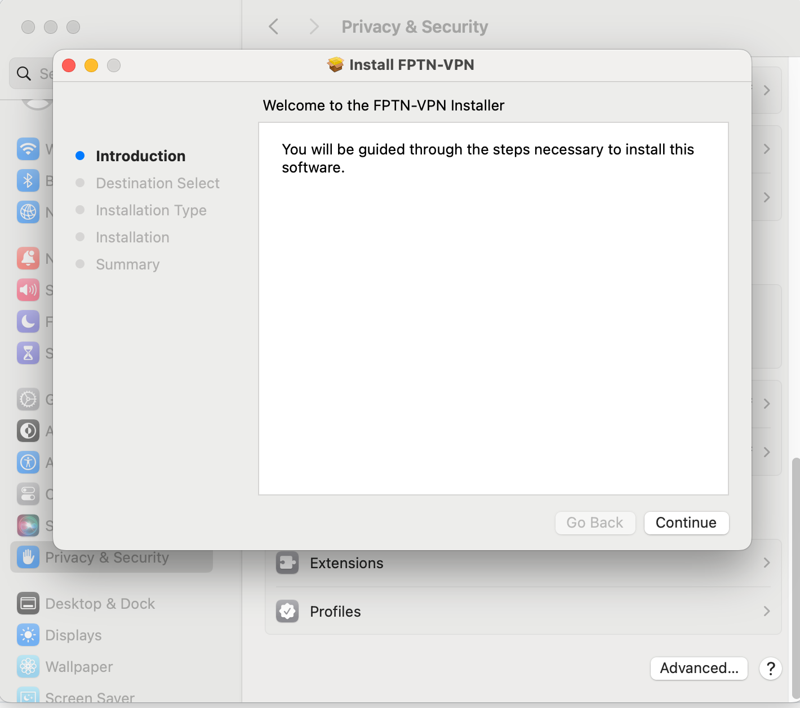
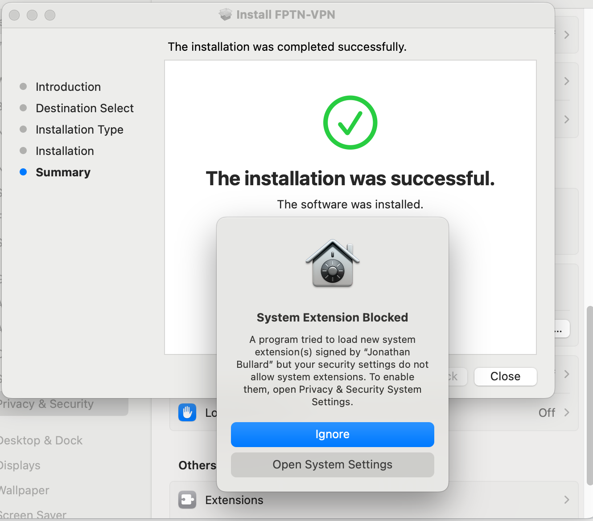
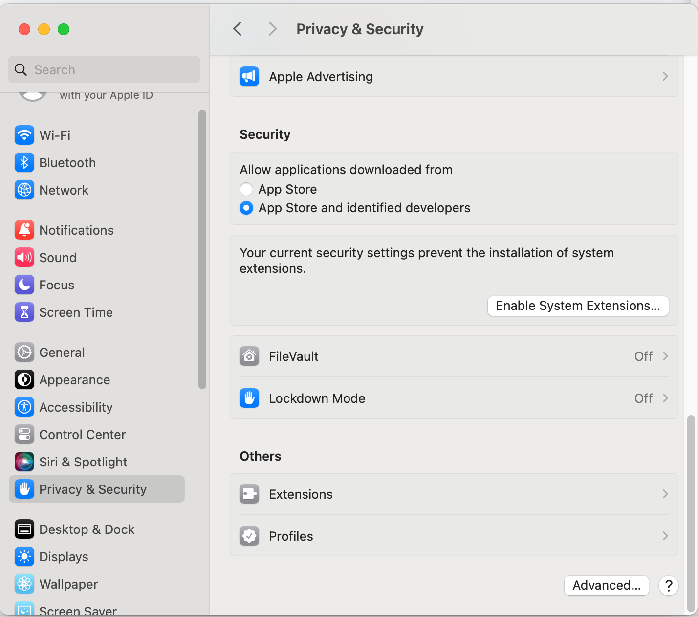

#### MacOS installation guide

To install on macOS, download the installation file from  [WebSite](http://batchar2.github.io/fptn/) or [GitHub](https://github.com/batchar2/fptn/releases)

Upon running the installer, you may see a warning. This is a common situation for unsigned applications.

To proceed with the installation, open "System Settings" --> "Privacy & Security" and click on "Open Anyway".

You will then need to enter your password to start the installation:

The system will show another warning. Just click on the "Open" button.

Next, proceed with installing the FptnClient:

After installation, you may receive a message about blocking a system extension:

This is normal as the FptnClient requires a special network driver. It uses the Tunnelblick TUN driver to create a virtual TUN interface and needs special access to install this driver.
Click "Open System Settings":

Disable "FileVault" and then click on "Enable System Extensions."
The system may prompt you to restart. Restart to activate the TUN driver:

After restarting:
1. Shut down your computer. Start it up by pressing the power button and holding it until your system starts in [macOS Recovery](https://support.apple.com/guide/mac-help/macos-recovery-a-mac-apple-silicon-mchl82829c17/mac) and you see the startup options page.
2. Select "Options."
3. Go to Utilities > Startup Security Utility.
4. Select the system you want to set the security policy for.
5. Click "Security Policy."
6. Check the box for “Allow user management of kernel extensions from identified developers.”
7. Click OK.
8. Restart your Mac for the changes to take effect.

After completing these steps, the application should work.
