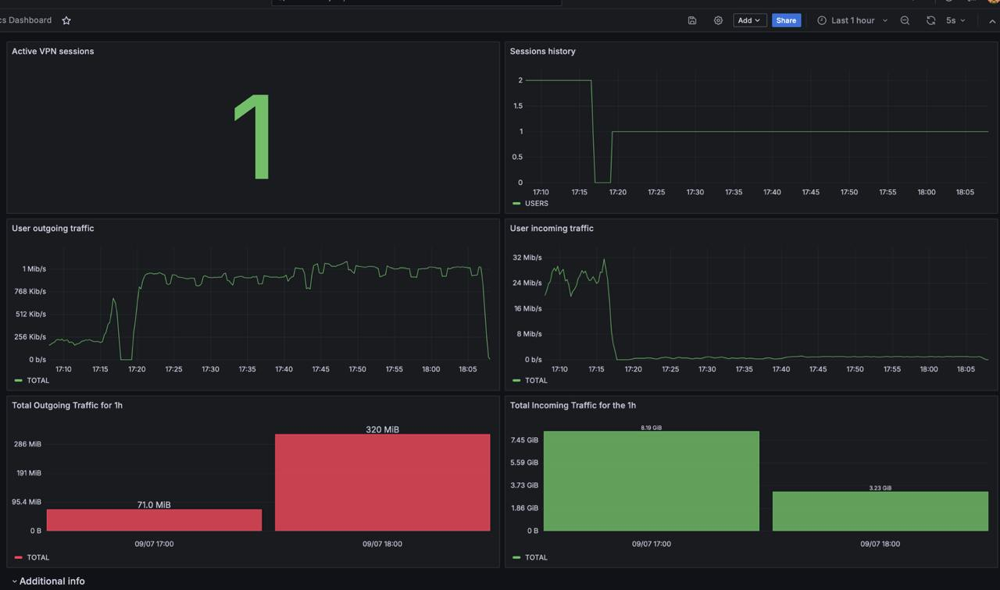
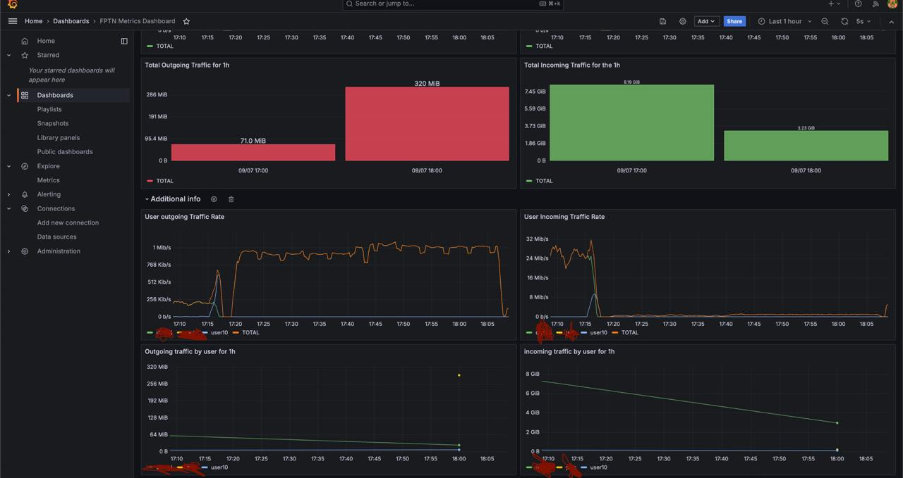

## Grafana

Grafana is used for monitoring server activity, including traffic amount and active users.





#### To set it up:

1. Copy and Configure Environment File:
   - Copy the .env.demo file to .env:
        ```bash
        cp .env.demo .env
        ```
   - Open the .env file and fill in all required fields. Pay special attention to the `PROMETHEUS_SECRET_ACCESS_KEY` parameter. 
   - This value should match the access key configured for the fptn-server.
2. Run Docker Compose:
   - Start Grafana and its dependencies using Docker Compose:
        ```bash
        docker-compose up -d
        ```
3. Access Grafana:
   Open your browser and navigate to the Grafana interface using the selected port. You can then proceed to set up your Grafana instance.

#### Notes:

Ensure that all parameters in the .env file are correctly configured before starting the services.
The `PROMETHEUS_SECRET_ACCESS_KEY` parameter must be consistent with the key used in fptn-server to allow proper access to metrics.
